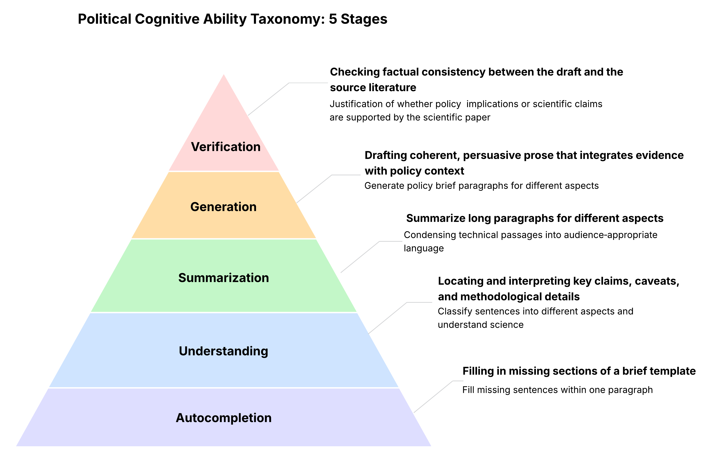

<h1 align="center"><a href="https://github.com/Northwestern-CSSI/Sci2Pol-Bench">Sci2Pol-Bench</h1> </a>

<h2 align="center">Data, scripts, and recipes for the benchmark Sci2Pol-Bench, a comprehensive benchmark for evaluating large language models.</h2>

<p align="center">
  <a href="#" target="_blank">
    
  </a>
  <a href="https://img.shields.io/badge/License-MIT-yellow.svg" target="_blank">
    
  </a>
  <a href="https://img.shields.io/badge/PRs-welcome-brightgreen.svg?style=flat-square" target="_blank">
    
  </a>
</p>

<p align="center">
  <a href="#about">About</a> •
  <a href="#usage">Usage</a>  •
  <a href="#authors">Authors</a>
</p>

### About


The data consists of policy briefs obtained from [Nature Energy](https://www.nature.com/nenergy/articles?type=policy-brief), [Nature Climate](https://www.nature.com/nclimate/articles?type=policy-brief), [Nature Cities](https://www.nature.com/natcities/articles?type=policy-brief), and [Journal of Health and Social Behavior Policy Briefs](https://www.asanet.org/publications/journals/journal-of-health-and-social-behavior-policy-briefs/).

[Policy briefs](https://www.nature.com/articles/s41560-019-0489-9) originally were introduced in the *Nature Energy* journal with the goal of:

>This format aims to provide policy professionals with accessible summaries of research papers published in our journal, written by the paper’s authors on invitation by our editors

Finding the reference scientific paper used for writing the policy briefs is relatively straightforward amongst the *Nature-x* briefs since each brief says "based on: title doi" for the associated paper. The information from *Journal of Health and Social Behavior Policy Briefs* operates on similar principle but the original paper had to be searched and manually discovered from the list of articles written by authors. Disambiguation of title was not necessary since most articles had either same or similar titles used for the policy brief.

### Usage
```
TBA
```


### Authors
[Weimin Wu](https://github.com/WeiminWu2000), [Alexander Furnas](https://github.com/alexanderfurnas), [Eddie](https://github.com/EddieYang211), [Akhil](https://github.com/akhilpandey95), [Guo Ye](#), [Xuefeng Song](#).

### Advisors
[Dashun Wang](https://dashunwang.com), [Han Liu](https://www.mccormick.northwestern.edu/research-faculty/directory/profiles/liu-han.html)

### License
[MIT License](https://github.com/Northwestern-CSSI/policyLLM/blob/main/LICENSE)
